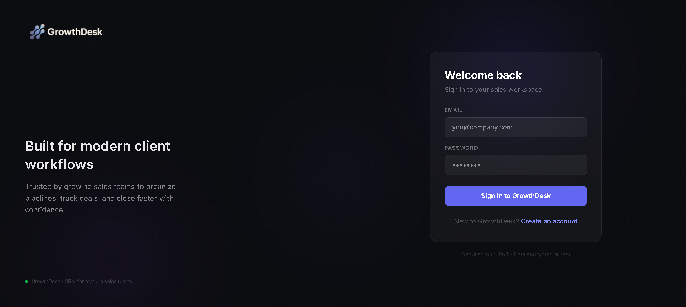
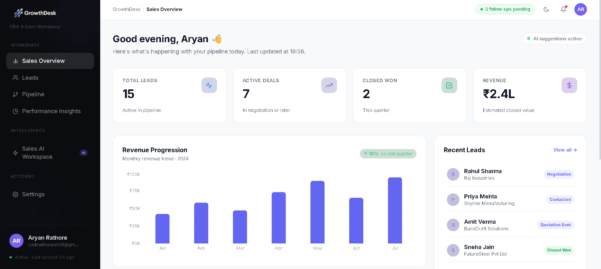
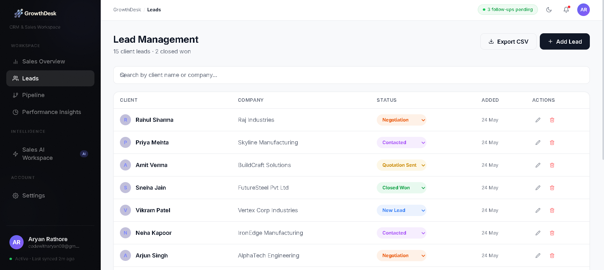
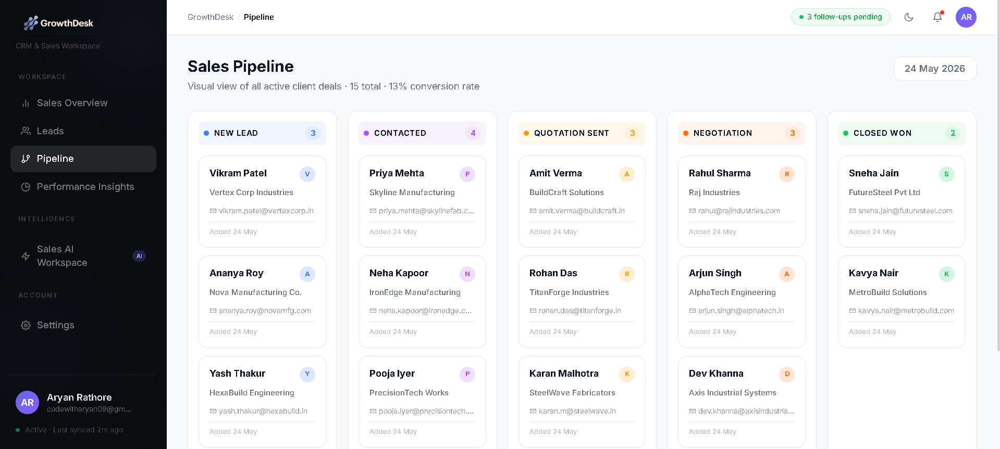
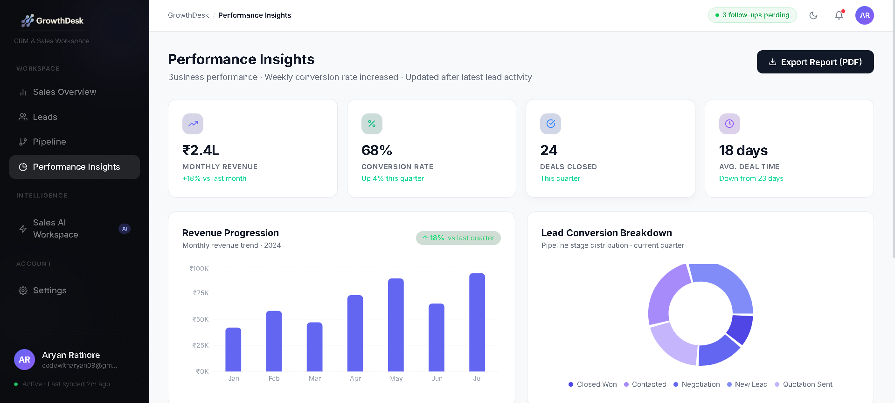
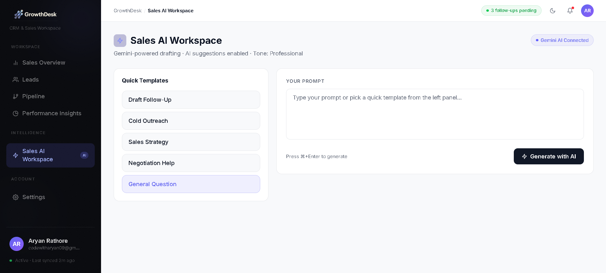

<div align="center">
  

  <br/>
  <br/>

# GrowthDesk CRM

### An AI-assisted CRM workspace built for modern B2B sales teams

  <br/>

  [](https://growth-desk-phi.vercel.app)
  [](https://growthdesk-backend.onrender.com)
  [](https://react.dev/)
  [](https://nodejs.org/)
  [](https://mongodb.com/)
  [](https://tailwindcss.com/)
  [](https://deepmind.google/technologies/gemini/)

</div>

---

## Why I Built This

Most CRMs I've worked with feel like a chore to maintain. They're built around data entry rather than helping you actually sell. GrowthDesk started as a personal project to fix that — a clean, focused workspace where sales teams can track deals, see what's happening at a glance, and get quick help from AI when they need to write a follow-up or handle a tough negotiation.

It's built on the MERN stack with Google's Gemini AI integrated into the workflow. Nothing overcomplicated. Just a practical tool that I'd want to use myself.

---

## 📸 Screenshots

### Login Experience


### Sales Overview


### Lead Management


### Sales Pipeline


### Performance Insights


### Sales AI Workspace


---

## Features

### Sales Overview
- Summary cards for total leads, active deals, closed deals, and estimated revenue
- Activity timeline showing recent changes across the pipeline
- Team status panel with per-rep lead counts
- Personalized greeting using the logged-in user's real name and time of day

### Lead Management
- Add, edit, and delete client leads
- Inline status updates directly from the table (no modal required)
- Search by client name or company
- CSV export for offline reporting

### Visual Pipeline
- Kanban-style board organized by deal stage (New Lead → Closed Won)
- Per-stage color-coded headers and card counters
- Hover lift effects on each deal card

### Performance Insights
- Revenue, conversion rate, and deal metrics
- Sales trend chart and conversion funnel chart (Recharts)
- Recent deal performance table with rep attribution
- One-click PDF export using jsPDF and html2canvas

### Sales AI Workspace (Gemini)
- Generate follow-up emails, cold outreach drafts, and negotiation responses
- Quick templates for common sales scenarios
- Session history for recent prompts
- Copy-to-clipboard with confirmation state

### Settings
- Profile info pulled directly from logged-in user (no hardcoded values)
- Dark/light mode toggle (persisted to localStorage)
- AI preferences — writing tone, auto-draft toggle
- Password change form (UI ready, backend-compatible)

### Auth
- JWT-based login and registration
- Protected routes on both frontend and backend
- User info stored in localStorage, read across all pages

---

## Tech Stack

**Frontend**
- React 19 with Vite
- Tailwind CSS v4 (custom dark mode via CSS variables)
- Framer Motion (page transitions and micro-animations)
- Recharts (sales and conversion charts)
- jsPDF + html2canvas (PDF export)
- React Hot Toast (notification system)
- React Icons (FI set)

**Backend**
- Node.js + Express.js
- MongoDB with Mongoose
- JWT for stateless authentication
- @google/genai (Gemini AI integration)

**Deployment**
- Frontend → Vercel
- Backend → Render

---

## Folder Structure

```
GrowthDesk/
├── client/                         # React + Vite frontend
│   ├── public/
│   │   └── favicon.png
│   └── src/
│       ├── assets/
│       │   ├── logo/               # logo-dark.png, favicon.png
│       │   └── screenshots/        # App screenshots for README
│       ├── components/             # Reusable UI components
│       │   ├── ActivityTimeline.jsx
│       │   ├── ConversionChart.jsx
│       │   ├── ProtectedRoute.jsx
│       │   ├── SalesChart.jsx
│       │   └── TeamCollaboration.jsx
│       ├── context/
│       │   └── ThemeContext.jsx     # Dark/light mode state
│       ├── layouts/
│       │   └── MainLayout.jsx      # Sidebar, header, page wrapper
│       ├── pages/
│       │   ├── AIAssistant.jsx
│       │   ├── Dashboard.jsx
│       │   ├── Leads.jsx
│       │   ├── Login.jsx
│       │   ├── Pipeline.jsx
│       │   ├── Register.jsx
│       │   ├── Reports.jsx
│       │   └── Settings.jsx
│       └── services/
│           ├── api.js              # Axios instance with auth header
│           └── authService.js      # Login / register API calls
│
└── server/                         # Node.js + Express backend
    ├── config/                     # DB connection setup
    ├── controllers/                # Route logic (auth, leads, AI)
    ├── middleware/                 # JWT auth verification
    ├── models/                     # Mongoose schemas (User, Lead)
    ├── routes/                     # API route definitions
    └── server.js                   # App entry point
```

---

## Local Setup

**Prerequisites:** Node.js 18+, MongoDB URI, Gemini API key

**1. Clone the repo**
```bash
git clone https://github.com/javawithaaryan/GrowthDesk.git
cd GrowthDesk
```

**2. Set up the backend**
```bash
cd server
npm install
```

Create a `.env` file inside `/server`:
```env
PORT=5000
MONGO_URI=your_mongodb_connection_string
JWT_SECRET=your_jwt_secret_key
GEMINI_API_KEY=your_gemini_api_key
```

Start the server:
```bash
npm run dev
```

**3. Set up the frontend**
```bash
cd ../client
npm install
```

Create a `.env` file inside `/client`:
```env
VITE_API_URL=http://localhost:5000
```

Start the frontend:
```bash
npm run dev
```

The app will be running at `http://localhost:5173`.

---

## Deployment

| Service | URL |
|---|---|
| Frontend (Vercel) | [growth-desk-phi.vercel.app](https://growth-desk-phi.vercel.app) |
| Backend (Render) | [growthdesk-backend.onrender.com](https://growthdesk-backend.onrender.com) |

> **Note:** The Render backend is on a free plan, so the first request after a period of inactivity may take 30–50 seconds to warm up. This is expected behaviour.

---

## What I'd Improve Next

A few things I'd build out if I continued this project:

- **Drag-and-drop pipeline** — Let users move cards between stages manually
- **Email sync** — Connect Gmail or Outlook to track replies inside the lead timeline
- **Role-based access** — Sales reps vs. managers with different views and edit permissions
- **Task reminders** — Scheduled follow-up alerts tied to specific leads
- **Analytics filters** — Filter reports by date range, rep, or deal stage

---

## Notes

- `.env` files are **not tracked** in this repository. All secrets are kept local and injected via environment variables on Vercel and Render.
- The AI workspace uses **Gemini 1.5 Flash** via the `@google/genai` SDK. Responses are generated server-side and returned to the frontend.
- Dark mode is implemented via CSS variables on the root element, toggled by adding/removing a `.dark` class — no framework dependency.

---

*Built by [Aaryan](https://github.com/javawithaaryan) as a full-stack project to explore AI-assisted SaaS workflows.*
